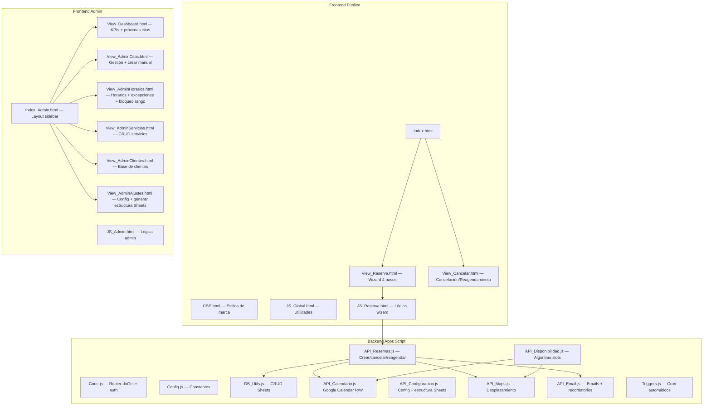

# ReservaCita — Plan de Implementación Actualizado

App de reserva de citas para Eduardo Callejo Osteopatía Madrid, construida en Google Apps Script.

---

## Datos Confirmados

| Dato | Valor |
|---|---|
| **Hoja de cálculo** | `1DP5weOc3PwN47WrzysogBJULa_m096tB6uLh5ah3-fE` |
| **Calendarios disponibilidad** | `eduardocvk@gmail.com`, `edu@ciudadjoven.org` (+ añadir más desde admin) |
| **Calendario citas** | `291d2d78...@group.calendar.google.com` |
| **Dirección consulta** | Plaza Santa Cristina 4, Madrid (configurable) |
| **Servicios** | Consulta (1h, 40€) y Domicilio (1h + desplazamiento, 45€) — configurables |
| **Días cerrados** | Viernes, Sábado, Domingo (configurable) |
| **Antelación mínima reserva** | 24h (configurable) |
| **Antelación mínima cancelación** | 4h (configurable) |
| **WhatsApp** | +34676435634 |
| **Email admin** | eduardocvk@gmail.com |
| **Iframe en** | osteopatiamadrid.com (reemplaza SimplyBook) |

---

## Arquitectura

---

## Estructura de la Hoja de Cálculo

> [!NOTE]
> Las pestañas y cabeceras se crearán automáticamente desde el botón "Generar estructura" en Ajustes del admin.

### Pestaña `Configuracion` (clave-valor)

| Clave | Valor por defecto |
|---|---|
| `nombre_negocio` | Eduardo Callejo - Osteopatía |
| `email_admin` | eduardocvk@gmail.com |
| `telefono` | +34676435634 |
| `direccion_consulta` | Plaza Santa Cristina 4, Madrid |
| `duracion_sesion_minutos` | 60 |
| `intervalo_slots_minutos` | 15 |
| `margen_entre_citas_consulta` | 15 |
| `margen_entre_citas_domicilio` | 30 |
| `antelacion_minima_horas` | 24 |
| `antelacion_maxima_dias` | 60 |
| `antelacion_cancelacion_horas` | 4 |
| `calendarios_disponibilidad` | eduardocvk@gmail.com,edu@ciudadjoven.org |
| `calendario_citas` | 291d2d78...@group.calendar.google.com |
| `url_logo` | https://osteopatiamadrid.com/lovable-uploads/eduardo-callejo-logo.png |
| `mensaje_confirmacion` | ¡Gracias por tu reserva! Te esperamos... |
| `politica_cancelacion` | Puedes cancelar hasta 4h antes... |
| `recordatorio_24h_activo` | true |
| `recordatorio_2h_activo` | true |
| `url_google_maps_resena` | [URL de reseñas de Google Maps] |
| `whatsapp` | +34676435634 |

### Pestaña `Horarios`

| Dia | Abierto | Hora_Inicio_1 | Hora_Fin_1 | Hora_Inicio_2 | Hora_Fin_2 |
|---|---|---|---|---|---|
| Lunes | TRUE | 09:00 | 14:00 | 16:00 | 20:00 |
| Martes | TRUE | 09:00 | 14:00 | 16:00 | 20:00 |
| Miércoles | TRUE | 09:00 | 14:00 | 16:00 | 20:00 |
| Jueves | TRUE | 09:00 | 14:00 | 16:00 | 20:00 |
| Viernes | FALSE | | | | |
| Sábado | FALSE | | | | |
| Domingo | FALSE | | | | |

### Pestaña `Excepciones`

| Fecha | Tipo | Hora_Inicio_1 | Hora_Fin_1 | Hora_Inicio_2 | Hora_Fin_2 | Motivo |
|---|---|---|---|---|---|---|

### Pestaña `Servicios`

| ID | Nombre | Descripcion | Duracion_Minutos | Tipo | Precio | Activo |
|---|---|---|---|---|---|---|
| 1 | Sesión de osteopatía | Tratamiento personalizado de osteopatía en consulta | 60 | consulta | 40 | TRUE |
| 2 | Osteopatía a domicilio | Sesión de osteopatía en tu domicilio | 60 | domicilio | 45 | TRUE |

### Pestaña `Citas`

| ID | Fecha | Hora_Inicio | Hora_Fin | Servicio_ID | Tipo | Estado | Cliente_Nombre | Cliente_Email | Cliente_Telefono | Cliente_Direccion | Tiempo_Desplazamiento | Token_Cancelacion | Fecha_Creacion | Notas | Calendar_Event_ID | Recordatorio_24h | Recordatorio_2h | Creada_Por |
|---|---|---|---|---|---|---|---|---|---|---|---|---|---|---|---|---|---|---|

- **Creada_Por**: `cliente` o `admin` (para saber si la agendó Eduardo manualmente)

### Pestaña `Clientes`

| Email | Nombre | Telefono | Direccion | Num_Citas | Ultima_Cita | Fecha_Registro |
|---|---|---|---|---|---|---|

---

## Archivos y Contenido Detallado

### Backend

#### [MODIFY] Code.js
- `doGet(e)`: Router — detecta `?admin=true`, `?cancel=TOKEN`, `?reagendar=TOKEN`, `?servicio=ID`
- `include(filename)`: Incluir HTML parciales
- `getUserEmail()`: Email del usuario logueado

#### [NEW] Config.js
- Constantes: IDs de Sheets, nombres de pestañas, email admin, timezone

#### [NEW] DB_Utils.js
- `getSheetDataAsJson()`, `insertRowData()`, `updateRowData()`, `deleteRow()`
- `getConfigValue(key)`, `setConfigValue(key, value)`, `getAllConfig()`
- `generarEstructuraHoja()`: **Crea todas las pestañas y cabeceras** + datos por defecto de Horarios y Servicios

#### [NEW] API_Disponibilidad.js
- `getAvailableSlots(dateString, serviceId)`: Algoritmo completo de slots en intervalos de 15 min
- `checkSlotAvailability(dateString, timeString, serviceId)`: Verificación individual
- `getDiasDisponiblesMes(year, month, serviceId)`: Mapa rápido del mes (para pintar el calendario)

#### [NEW] API_Calendario.js
- `getCalendarEvents(dateString)`: Lee eventos de todos los calendarios configurados
- `createCalendarEvent(citaData)`: Crea evento con título `🦴 [Nombre] - [Servicio]`
- `deleteCalendarEvent(eventId)`: Elimina evento
- `updateCalendarEvent(eventId, newData)`: Actualiza evento

#### [NEW] API_Reservas.js
- `crearReserva(datosReserva)`: Flujo completo (validar → insertar → Calendar → email)
- `crearReservaAdmin(datosReserva)`: Versión admin (email opcional, sin captcha)
- `cancelarReserva(token)`: Cancelación por token
- `reagendarReserva(token, nuevaFecha, nuevaHora)`: Reagendamiento
- `getCitasPorFecha(inicio, fin)`, `getProximasCitas()`, `getEstadisticas()`
- `actualizarEstadoCita(citaId, nuevoEstado)`

#### [NEW] API_Configuracion.js
- `getConfigPublica()`: Datos visibles para clientes
- `getConfigAdmin()`, `saveConfigAdmin(data)`: CRUD config completa
- `getHorarios()`, `saveHorarios(data)`: CRUD horarios
- `getExcepciones()`, `addExcepcion(data)`, `deleteExcepcion(rowIndex)`: CRUD excepciones
- `bloquearRangoFechas(fechaInicio, fechaFin, motivo)`: Crear excepciones en bloque
- `getServicios()`, `saveServicio(data)`, `toggleServicio(id, activo)`: CRUD servicios

#### [NEW] API_Maps.js
- `calcularTiempoDesplazamiento(origen, destino)`: Google Maps Directions API con cache
- `validarDireccion(direccion)`: Geocoding

#### [NEW] API_Email.js
- `enviarConfirmacionCliente(citaData)`: Email confirmación con enlace cancelar/reagendar + WhatsApp
- `enviarNotificacionAdmin(citaData, tipo)`: Notificación al admin
- `enviarRecordatorio(citaData, horasAntes)`: Recordatorio 24h y 2h
- `enviarSolicitudResena(citaData)`: Email post-cita con enlace a Google Maps para dejar reseña
- `buildEmailTemplate(contenido)`: Template HTML con marca Eduardo Callejo

#### [NEW] Triggers.js
- `setupTriggers()`: Instalar triggers
- `processRecordatorios()`: Enviar recordatorios pendientes (cada hora)
- `processCitasPasadas()`: Marcar como completadas (diario)
- `processSolicitudesResena()`: Enviar solicitud de reseña 24h post-cita (diario)

---

### Frontend Público

#### [NEW] Index.html
- Header con logo centrado
- Contenedor del wizard de reserva
- Footer con © + enlace admin discreto + WhatsApp

#### [NEW] View_Reserva.html
**Wizard de 4 pasos** con barra de progreso animada:
1. **Servicio**: Cards seleccionables (consulta / domicilio) con precio e icono
2. **Fecha y hora**: Mini-calendario + grid de slots de 15 min
3. **Tus datos**: Nombre, email, teléfono, dirección (si domicilio), notas, captcha suave (pregunta sencilla tipo "¿Cuánto es 3+4?")
4. **Confirmar**: Resumen + botón confirmar → pantalla de éxito con WhatsApp

#### [NEW] View_Cancelar.html
- Vista de cancelación por token
- Vista de reagendamiento por token (seleccionar nueva fecha/hora)
- Validación de plazo mínimo (4h)

#### [NEW] CSS.html
Paleta derivada del logo:
- Primary: `#2A9D8F` (teal)
- Secondary: `#264653` (azul oscuro)
- Accent: `#5CB896` (verde claro)
- Fondo blanco, tipografías Inter + Playfair Display
- Diseño responsive, animaciones suaves, glassmorphism en admin

#### [NEW] JS_Global.html
- `app.fetchData()`, `app.showLoader()`, `app.showToast()`, utilidades de formato

#### [NEW] JS_Reserva.html
- Estado del wizard, navegación entre pasos, calendario, slots, validación, envío

---

### Frontend Admin

#### [NEW] Index_Admin.html
Layout sidebar (patrón Empleo): Dashboard, Citas, Horarios, Servicios, Clientes, Ajustes

#### [NEW] View_Dashboard.html
KPIs (citas hoy/semana/mes, cancelaciones) + próximas 5 citas + acciones rápidas

#### [NEW] View_AdminCitas.html
Tabla de citas con filtros + **botón "Nueva cita"** para agendar manualmente (email opcional) + modal detalle

#### [NEW] View_AdminHorarios.html
Tabla editable 7 días + sección excepciones con calendario + **bloqueo rápido de rango de fechas**

#### [NEW] View_AdminServicios.html
Lista de servicios con toggle + modal crear/editar

#### [NEW] View_AdminClientes.html
Tabla de clientes + historial de citas por cliente

#### [NEW] View_AdminAjustes.html
Formulario de configuración general + sección calendarios (añadir/quitar) + **botón "Generar estructura de hoja de cálculo"**

#### [NEW] JS_Admin.html
Navegación SPA, CRUD de todas las secciones, renderizado de tablas y modales

---

## Orden de Implementación

> [!IMPORTANT]
> **Frontend primero**, luego backend. El botón de generar estructura de Sheets estará en Ajustes del admin.

### Fase 1 — Infraestructura mínima
1. `appsscript.json` — manifiesto
2. `Config.js` — constantes
3. `Code.js` — doGet básico + include + auth

### Fase 2 — Frontend completo
4. `CSS.html` — estilos
5. `JS_Global.html` — utilidades compartidas
6. `Index.html` — template público
7. `View_Reserva.html` — wizard de reserva
8. `View_Cancelar.html` — cancelación/reagendamiento
9. `JS_Reserva.html` — lógica del wizard
10. `Index_Admin.html` — template admin
11. `View_Dashboard.html`
12. `View_AdminCitas.html` (con creación manual, email opcional)
13. `View_AdminHorarios.html` (con bloqueo rango)
14. `View_AdminServicios.html`
15. `View_AdminClientes.html`
16. `View_AdminAjustes.html` (con botón generar estructura Sheets)
17. `JS_Admin.html`

### Fase 3 — Backend datos
18. `DB_Utils.js` — incluyendo `generarEstructuraHoja()`
19. `API_Configuracion.js`

### Fase 4 — Backend lógica
20. `API_Calendario.js`
21. `API_Maps.js`
22. `API_Disponibilidad.js`
23. `API_Email.js`
24. `API_Reservas.js`
25. `Triggers.js`

### Fase 5 — Testing y deploy
26. Test completo
27. Deploy Web App
28. Configurar triggers
29. Integrar iframe en osteopatiamadrid.com
